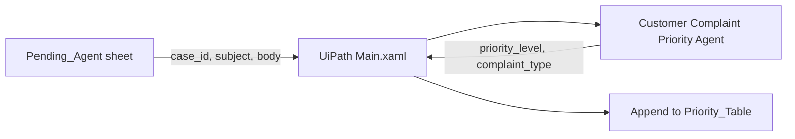

# Enterprise Complaint Priority Agent

An enterprise AI automation prototype that reads complaint records from Google Sheets, asks a UiPath AI agent to assign a priority and complaint type, and appends the structured result to a second sheet.

> **Portfolio status:** The supplied UiPath source supports the classification step of a larger team workflow. It does not include email ingestion, automated replies, employee/manager routing, or a deployed end-to-end system.

## At a glance

- **My contribution:** “My primary contribution focused on configuring the AI agent in UiPath and defining the priority-classification logic.”
- **Decision contract:** `Low`, `Medium`, or `High`, plus one of 20 allowed complaint types.
- **Implemented path:** `Pending_Agent` sheet → UiPath process → AI agent → `Priority_Table` sheet.
- **Evidence:** [agent configuration](workflow/Customer%20Complaint%20Priority%20Agent/agent.json), [prompt](prompts/system-prompt.md), [classification rules](docs/priority-classification.md), and [evaluation evidence](evaluation/README.md).
- **Demo:** No public video, screenshot, or live deployment was included in the supplied materials.

## Business problem

Customer-service teams need to separate routine questions from cases that require human follow-up or urgent escalation. This prototype turns an email subject and body into a structured priority decision that a workflow can use downstream.

The broader team concept covers complaint-email intake, AI classification, and later handling. The source package reviewed here only proves the middle classification workflow and its Google Sheets input/output integration.

## Workflow overview



The process reads each row in `Pending_Agent`, passes `case_id`, `email_subject`, and `email_body` to the agent, and appends `case_id`, `priority_level`, and `complaint_type` to `Priority_Table`. See [architecture.md](docs/architecture.md) for code-level evidence.

## AI vs. rules

| Layer | Responsibility | Evidence |
|---|---|---|
| AI agent | Interprets the subject and body; chooses the priority and complaint type | [`agent.json`](workflow/Customer%20Complaint%20Priority%20Agent/agent.json) |
| Prompt rules | Define the three levels, 20 allowed labels, highest-priority-wins escalation, and output constraints | [System prompt](prompts/system-prompt.md) |
| UiPath workflow | Reads rows, maps three input fields, runs the agent, and appends three output fields | [`Main.xaml`](workflow/02_Complaint_Classification/Main.xaml) |

The workflow does not contain a separate deterministic rules engine or post-model label validator. The taxonomy is enforced through the prompt.

## My contribution and team context

My primary contribution focused on configuring the AI agent in UiPath and defining the priority-classification logic. The supplied evidence supports the following details:

- defining the `Low` / `Medium` / `High` decision framework and complaint taxonomy;
- encoding the escalation rule and output constraints in the agent prompt;
- configuring the UiPath agent input/output schema and low-temperature model settings.

Email ingestion, Google Sheets connection ownership, downstream automation, deployment, and work completed by other team members are presented only as project context. The available files do not establish individual authorship for those components.

The project includes classification examples and one evaluation case, but the supplied files do not establish who created them or preserve a dated record of my specific test runs and prompt adjustments.

## Validation

The supplied UiPath evaluation set contains **one stored case** with an expected result: a washing-care question labeled `Low / Washing/Care Instructions`. It is marked as originating from a first successful run, but the package does not retain the actual output, evaluator score, or run trace.

Eleven additional DOCX files provide demo/test inputs. They contain no saved model outputs. For portfolio review, [proposed annotations](evaluation/proposed-annotations.csv) apply the current prompt rules to those inputs and are explicitly separated from historical run results.

See [evaluation/README.md](evaluation/README.md) for evidence levels, ambiguities, and a reproducible future evaluation plan.

## Run in UiPath

Prerequisites:

- UiPath Studio compatible with the supplied project (`studioVersion` is `26.0.194.0`);
- access to UiPath Agent Builder and a configured model connection;
- a Google Sheets Integration Service connection;
- the dependencies pinned in [`project.json`](workflow/02_Complaint_Classification/project.json).

Setup:

1. Open `workflow/02_Complaint_Classification/project.json` in UiPath Studio.
2. Import or recreate the agent from `workflow/Customer Complaint Priority Agent`.
3. Rebind both Google Sheets activities in `Main.xaml`; deployment-specific URLs and connection IDs were redacted.
4. Create a `Pending_Agent` range with the columns listed in [architecture.md](docs/architecture.md), including `case_id`, `email_subject`, and `email_body`.
5. Create a `Priority_Table` range with `case_id`, `priority_level`, and `complaint_type`.
6. Run the process and review the appended rows before using them for customer handling.

## Limitations and next steps

- No UiPath runtime verification was executed in this environment.
- No aggregate accuracy, latency, cost, throughput, time-saved, or business-impact result is supported by the files.
- The saved evaluation evidence covers only one category and stores no score or actual output.
- The workflow has no visible schema validation, retry, confidence threshold, human-review gate, deduplication, or explicit exception path.
- The supplied source does not implement automatic reply generation or priority-based routing.
- The design-stage Excel taxonomy differs from the current agent prompt; the discrepancy is documented in [priority-classification.md](docs/priority-classification.md).

The next useful step is to freeze a balanced labeled dataset across all 20 current labels, preserve raw outputs and configuration per run, and add human review for invalid or ambiguous classifications.

## Repository map

```text
.
├── README.md
├── docs/
│   ├── architecture.md
│   ├── priority-classification.md
│   └── source-audit.md
├── evaluation/
│   ├── README.md
│   ├── proposed-annotations.csv
│   └── provided-email-fixtures.jsonl
├── evidence/
│   └── classification-design-dictionary.xlsx
├── prompts/
│   ├── README.md
│   ├── system-prompt.md
│   └── user-prompt.md
└── workflow/
    ├── README.md
    ├── 02_Complaint_Classification/
    └── Customer Complaint Priority Agent/
```

No license was added because the supplied project did not include one and public licensing authority was not established.
