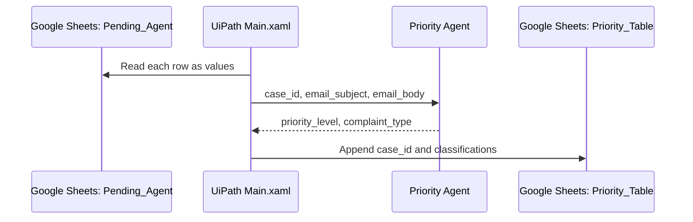

# Architecture

## Current implementation

The orchestration is implemented in [`Main.xaml`](../workflow/02_Complaint_Classification/Main.xaml). The agent schema, prompt, and model settings are stored in [`agent.json`](../workflow/Customer%20Complaint%20Priority%20Agent/agent.json).

## Data contract

The source sheet metadata lists these input columns:

`case_id`, `order_id`, `email_message_id`, `received_at`, `sender_name`, `sender_email`, `email_subject`, `email_body`, `has_attachment`, `attachment_count`, `processing_status`.

Only three are passed to the agent:

| Agent input | Type | Source |
|---|---|---|
| `case_id` | string | `CurrentRow.case_id` |
| `email_subject` | string | `CurrentRow.email_subject` |
| `email_body` | string | `CurrentRow.email_body` |

The process appends these fields to `Priority_Table`:

| Output | Type | Current enforcement |
|---|---|---|
| `case_id` | string | Returned by the agent |
| `priority_level` | string | Prompt requires `Low`, `Medium`, or `High` |
| `complaint_type` | string | Prompt requires one of 20 predefined labels |

The JSON schema declares strings but does not define enums. No post-model validator is visible in the XAML.

## Agent configuration

The supplied agent artifact is configured with:

- model: `gpt-5.6-terra`;
- temperature: `0.1`;
- maximum output tokens: `1379`;
- maximum iterations: `1`;
- engine: `basic-v2`;
- no tools, resources, or memory.

An earlier project description mentioned GPT-4o, but no GPT-4o configuration appears in the supplied UiPath source. This document follows the source artifact.

## What is outside the evidence boundary

The supplied package does not contain implementation evidence for mailbox ingestion, automatic customer replies, employee/manager routing, status updates, or a production deployment. The classification design PDF discusses those broader steps as a planned team workflow; they are not represented as current implementation here.

## Public-copy redactions

The original package contained a personal connection name, a Google Sheets URL, a connection identifier, a workspace path, and deployment project IDs. The public workflow keeps the source structure but replaces those environment-specific values. The original `.uis` package, connector resource, `userProfile`, and `.local` settings are not included.

